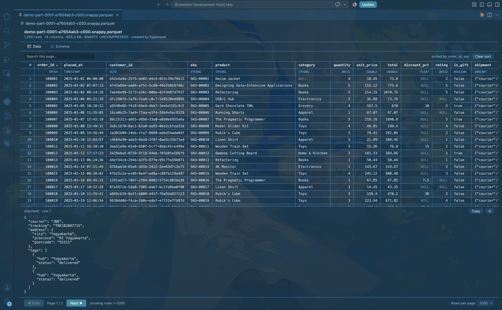
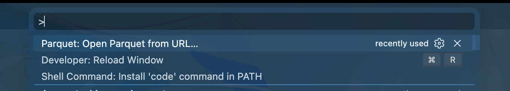
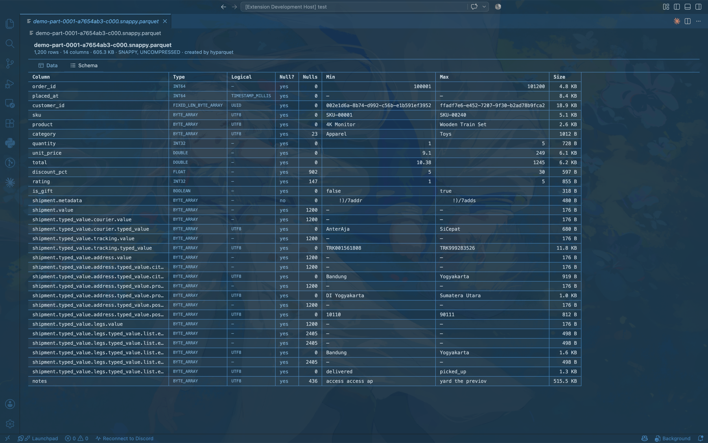

# Parquet Reader

Open `.parquet` files in VS Code and read them as a table — column types, per-column
statistics, and full nested values, without leaving the editor and without loading the whole
file into memory.

## Features

### Remote files over HTTPS and S3

Run **Parquet: Open Parquet from URL…** from the Command Palette:

Then paste an `https://` or `s3://` URL:

- **`https://`** — the server must support HTTP range requests. If it does not, the viewer
  says so instead of silently downloading the entire file.
- **`s3://bucket/key.parquet`** — signed by shelling out to `aws s3 presign`, so your existing
  AWS profile or SSO session does the signing and no credential ever passes through this
  extension. Presigned `https://` URLs work directly, with no AWS CLI required.

Remote files are read the same way as local ones: only the footer and the data pages you are
actually looking at cross the network.

### Opens from the Explorer

Double-click any `.parquet` or `.pq` file. No command to run, no conversion step. The viewer
is strictly read-only — it never writes back to your file.

The header reports what the file actually contains: row count, column count, file size,
the compression codecs in use, and the writer that produced it.

### Data tab

- Rows per page is picked in the footer — 25, 50, 100, 250, 500 or 1000 — with row numbers and
  a sticky two-line header showing each column name and its type
- Numeric columns are right-aligned; `NULL` is rendered distinctly from an empty string
- Nested columns (`STRUCT`, `LIST`, `MAP`, `VARIANT`) stay in a single column, rendered as JSON
- Long values are shortened to 200 characters in the grid, so a page stays fast to render

### Search within the page

Type in the box above the table to keep only the rows that match and highlight the matches.
It is case-insensitive and looks at every column.

This searches the page you are looking at, not the whole file — the count beside the box says
so. It runs entirely inside the view: nothing is sent to the extension, and no byte is read.

### Column sorting

Click a column header to cycle ascending → descending → back to file order.

Sorting compares the values themselves rather than their printed form, so `9` sorts before `10`
and timestamps sort chronologically. `NULL` sorts last in both directions, because it is the
absence of a value rather than the smallest one.

Nested columns (`STRUCT`, `LIST`, `MAP`, `VARIANT`) and repeated columns hold more than one value
per row, so there is nothing single to order by. Their headers show a `not-allowed` cursor, and
clicking one explains why in the toolbar rather than silently doing nothing.

Sorting reads the whole file into memory, so it is capped by `parquetReader.sortCellBudget`
(500,000 cells by default, counted as rows × columns). Beyond that limit the headers stop
responding and explain the limit, rather than freezing the window on a file that will not fit.

### Cell detail

Click any cell to see its untruncated value in the pane below the table. Nested values are
pretty-printed, and **Copy** puts the full value on your clipboard. Press `Esc` to close.

The full value is fetched on demand, one cell at a time — it is never included in the page
payload, which is what keeps wide, deeply nested files responsive.

### Schema tab

One row per leaf column, using dotted paths for nested fields. For each column: physical type,
logical type, nullability, null count, min, max, and compressed size summed across all row
groups. Columns whose writer omitted statistics show `—` rather than a misleading zero.

### Follows your theme

Light, dark, and high contrast themes are all supported — the viewer uses VS Code's own colour
tokens rather than its own palette.

## Performance

The viewer never reads a whole file. It reads the footer for metadata, then only the data
pages needed for the rows on screen, using the file's offset index when one is present.

A 180 MB file with 1,244,896 rows stored in a single row group on S3 opens in 1–2 seconds,
and page navigation stays under a second. Without offset-index support the same file took
about 30 seconds to display its first page, because the first read had to pull every column
chunk in the row group.

Files written without an offset index (for example, PyArrow without `write_page_index=True`)
fall back to reading whole column chunks, which is correct but slower to open.

## Requirements

- VS Code 1.90 or newer
- The AWS CLI, only if you want to open `s3://` URLs. Everything else works out of the box.

## Extension settings

| Setting | Default | What it does |
|---|---|---|
| `parquetReader.pageSize` | `100` | Rows per page, 25 to 1000. Also set by the picker in the footer. Lowered automatically on wide files — see below. |
| `parquetReader.sortCellBudget` | `500000` | Largest file column sorting will load, in cells (rows × columns). `0` turns sorting off. |

Page size does not change how much of the file is read: the smallest unit Parquet can read is a
data page, which is already larger than any page of rows, so 1000 rows costs the same bytes as
100. What it does change is rendering, and that grows with rows × columns rather than with rows
alone. So the effective page size is capped at roughly 20,000 cells: a 4-column file gets the
full 1000 rows, a 60-column file gets 333. The footer says when the value was lowered.

The **Rows per page** picker in the footer writes this same setting, so a choice made there
sticks for the next file you open. Both settings take effect immediately in open tabs — changing
the page size keeps whichever row was at the top of the page in view.

## Known limitations

- Read-only. The viewer never writes back to your file.
- Search covers the current page, not the whole file. Whole-file search is not implemented yet.
- Sorting is limited to files under `parquetReader.sortCellBudget`, and to one column at a time.
  There is no filtering or query support yet.
- A `BYTE_ARRAY` column carrying no logical type is decoded as UTF-8 text by the underlying
  reader, so genuinely binary columns (hashes, blobs) display as unreadable text.
- Presigned S3 URLs expire after one hour. Reopening re-signs automatically, because the
  original `s3://` URL is what gets stored, not the signature.

## License

MIT — see [LICENSE](LICENSE).
